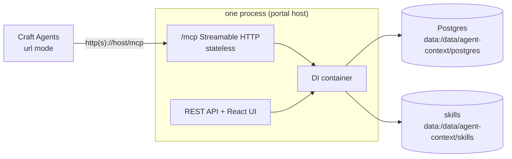

# Connecting Craft Agents to a Deployed Agent Context over Streamable HTTP

> **Preferred since T14**: the platform serves its MCP toolset natively over
> Streamable HTTP at `/mcp` — Craft Agents connects with a single URL, no local
> binary and no docker command in the source config. The docker-exec stdio
> workaround (pre-T14) is kept at the end as a fallback for older images.

## Why one URL?

The platform hosts **UI + REST API + MCP in one process** (the portal):
`ModelContextProtocol.AspNetCore` maps the v1 toolset at `/mcp` (stateless
Streamable HTTP — the SDK's recommended remote transport, no session affinity).
Running the binary with **no arguments starts the full environment** as an
Aspire DistributedApplication — postgres + portal + Aspire dashboard, one
command, no flags to remember.



## Run options (3-in-1 startup)

| Style | Command | What comes up |
|---|---|---|
| Local / default | `dotnet run` (no args) | Aspire-managed postgres + portal (UI+MCP on :8080) + in-process dashboard (internal :18888, browser route `/monitor/resources`) |
| Docker compose | `docker compose up -d` | AppHost image with portal (UI+MCP on :8080, dashboard at `/monitor/resources`, internal :18888) + external postgres — db and skills share one `data` volume under `/data/agent-context/` |

## Craft Agents source — config.json (URL mode)

```json
{
  "id": "agent-context_<random-8-hex>",
  "name": "Agent Context",
  "slug": "agent-context",
  "enabled": true,
  "provider": "agent-context",
  "type": "mcp",
  "icon": "🧠",
  "tagline": "Shared context layer — report sessions, search knowledge, load skills",
  "mcp": {
    "url": "http://localhost:8080/mcp",
    "authType": "none"
  }
}
```

Point `url` at the reachable surface: `http://localhost:8080/mcp` for a local
no-args run, or `https://agent-context.orb.local/mcp` behind the compose
proxy. No `env` needed — the portal child already receives its database
connection from the AppHost.

## Docker image build

The Dockerfile has three stages: Node builds the React UI, the .NET SDK
publishes the Host, and the `aspnet` runtime image runs the AppHost. BuildKit
caches npm packages and target-architecture NuGet packages:

```bash
docker compose up -d --build
# or, for an explicit architecture:
docker buildx build --platform linux/arm64 --load -t agent-context:local .
```

The Aspire AppHost SDK's DCP and Dashboard RID packages are tooling dependencies
that `dotnet publish` omits from `deps.json`, so the build stages the selected
packages into the runtime NuGet cache. The temporary staging directory is kept
outside `/app`; otherwise the final image would contain a duplicate copy of
roughly 229 MB. Missing RID packages fail the build instead of producing an
image that only fails at AppHost startup.

## permissions.json — Explore-mode access

```json
{
  "allowedMcpPatterns": [
    { "pattern": "search", "comment": "search_memory / find_similar_solution — read-only retrieval" },
    { "pattern": "get", "comment": "get_skill — read-only skill loading" },
    { "pattern": "rate", "comment": "rate_knowledge — feedback drives Confidence (read-oriented)" }
  ]
}
```

## Prerequisites for a working toolset

- **Setup**: a fresh database needs the first-run wizard first
  (`POST /api/setup`) — `save_session` and friends require a workspace.
- **LLM endpoint**: `search_memory`, `find_similar_solution` and the Learning
  Engine need an OpenAI-compatible endpoint in the `settings` table
  (`PUT /api/settings/llm-options` with `baseUrl` / `apiKey` / `model` /
  `embeddingModel`, or the Settings page). Takes effect immediately; reads only
  return a `maskedApiKey` — never commit real credentials to source control,
  prefer environment variables (e.g. `$AZURE_OPENAI_API_KEY`).

## Validate

Run the Craft Agents `source_test` flow — a successful connection reports all
five v1 tools:

`save_session`, `search_memory`, `find_similar_solution`, `get_skill`, `rate_knowledge`

## Full loop (validated 2026-08-16, URL mode)

1. `source_test` over `http://localhost:8080/mcp` → five tools visible.
2. `save_session(domain="dev", task=…, conclusion=…, keySnippets=[…], model=…)`
   → Session persisted as `pending`.
3. The in-process Learning Engine extracted → **3 Knowledge rows**,
   Confidence ≈ 0.58–0.59.
4. `search_memory(domain="dev", query="how does Craft Agents connect by URL")`
   → top hit "通过 URL 连接 Streamable HTTP MCP 端点" at **score 0.709**.

## Troubleshooting

- **`save_session` fails on a fresh database** — no workspace yet; run setup first.
- **`search_memory` returns "LLM 端点尚未配置"** — LLM options not saved (per-call
  resolution, no restart needed).
- **`get_skill` returns "skill 不存在"** — empty skills volume / unregistered
  slug; normal data state, not a connection failure.
- **`An error occurred invoking '…'`** — the MCP wrapper swallows inner
  exceptions; real stacks go to the process stderr (`docker logs` in compose,
  the terminal in a local run).

